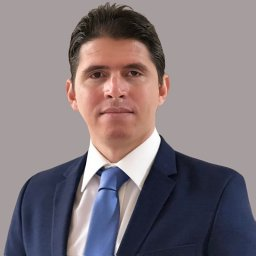

#  Hello! I'm Adrian Dominguez Castro

{:style="width: 180px; border-radius: 50%;"}

Adrian Dominguez Castro, PhD 
𝗠𝗮𝗰𝗵𝗶𝗻𝗲 𝗟𝗲𝗮𝗿𝗻𝗶𝗻𝗴 𝗘𝗻𝗴𝗶𝗻𝗲𝗲𝗿 | 𝗤𝘂𝗮𝗻𝘁𝗶𝘁𝗮𝘁𝗶𝘃𝗲 𝗔𝗻𝗮𝗹𝘆𝘀𝘁 | 𝗖𝗼𝗺𝗽𝘂𝘁𝗮𝘁𝗶𝗼𝗻𝗮𝗹 𝗖𝗵𝗲𝗺𝗶𝘀𝘁

 
With over a decade of experience in 𝗠𝗮𝗰𝗵𝗶𝗻𝗲 𝗟𝗲𝗮𝗿𝗻𝗶𝗻𝗴, 𝗣𝘆𝘁𝗵𝗼𝗻, 𝗤𝘂𝗮𝗻𝘁𝗶𝘁𝗮𝘁𝗶𝘃𝗲 𝗔𝗻𝗮𝗹𝘆𝘁𝗶𝗰𝘀, 𝗮𝗻𝗱 𝗖𝗼𝗺𝗽𝘂𝘁𝗮𝘁𝗶𝗼𝗻𝗮𝗹 𝗖𝗵𝗲𝗺𝗶𝘀𝘁𝗿𝘆 , I specialize in delivering impactful, data-driven solutions that bridge the gap between research and industry. My journey has been shaped by a strong foundation in academia, including a 𝗣𝗵𝗗 𝗶𝗻 𝗣𝗵𝘆𝘀𝗶𝗰𝘀 (𝗗𝗿. 𝗿𝗲𝗿. 𝗻𝗮𝘁.) from the 𝗨𝗻𝗶𝘃𝗲𝗿𝘀𝗶𝘁𝘆 𝗼𝗳 𝗕𝗿𝗲𝗺𝗲𝗻, 𝗚𝗲𝗿𝗺𝗮𝗻𝘆, and 𝗣𝗼𝘀𝘁𝗱𝗼𝗰𝘁𝗼𝗿𝗮𝗹 𝗥𝗲𝘀𝗲𝗮𝗿𝗰𝗵 𝗮𝘁 𝗩𝗮𝗻𝗱𝗲𝗿𝗯𝗶𝗹𝘁 𝗨𝗻𝗶𝘃𝗲𝗿𝘀𝗶𝘁𝘆, 𝗨𝗦𝗔, where I led a project focused on applying Machine Learning to advance Computational Chemistry.

As the Founder and Principal Consultant of 𝗔𝗗𝗖 𝗦𝗰𝗶𝗲𝗻𝘁𝗶𝗳𝗶𝗰 𝗖𝗼𝗻𝘀𝘂𝗹𝘁𝗶𝗻𝗴, I work with organizations to apply 𝗗𝗮𝘁𝗮 𝗦𝗰𝗶𝗲𝗻𝗰𝗲 and 𝗠𝗮𝗰𝗵𝗶𝗻𝗲 𝗟𝗲𝗮𝗿𝗻𝗶𝗻𝗴 to real-world challenges in technology, quantitative finance, and other fields. My goal is to bridge the gap between cutting-edge research and practical, scalable solutions that drive measurable impact.

I’ve worked across five countries (Cuba, Canada, The Netherlands, Germany, and the USA), contributing to multidisciplinary projects and co-authoring peer-reviewed publications in machine learning, quantum chemistry, and computational simulations.

Beyond technical expertise, I bring a global perspective, a commitment to innovation, and a track record of collaboration across diverse teams and sectors. Whether it's building predictive models, software development, analyzing data trends, or implementing scalable machine learning solutions, I am passionate about leveraging data to drive insights and informed decision-making.

👉 [View Projects](projects.md) | [CV](cv.md) | [Contact](contact.md)
