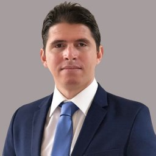

  

## About Me

**Quantitative Data Scientist & AI/ML Engineer (Ph.D.)**

* **Core Focus:** Production LLM Systems, Hybrid RAG, Agentic Workflows & Quantitative ML.
* **Impact:** Building end-to-end AI architectures that turn complex, high-dimensional scientific data into production-ready business assets.

### Selected Engagements
### Principal AI/ML Engineering Contractor (Sept 2024 – Present)
**Independent AI/ML Consulting**

Partnered directly with executive stakeholders and cross-functional teams to translate complex business problem statements into technical AI/ML roadmaps and production-grade architectures[cite: 1].

#### Selected Engagements:

* **Healthcare & Research AI:** Decimal.health | OncoBrain, AccelerOnc Studio, Moffitt Cancer Center
  * Architected end-to-end hybrid RAG systems (Dense + BM25, Cohere Rerank) for unstructured oncology data, achieving high context retrieval precision across complex clinical records.
  * Engineered automated ingestion pipelines using deep-parsing web scrapers and self-healing multi-agent validation loops, reducing data processing latency by 90%.
  * Built autonomous AI agents using LangGraph with deterministic cyclic evaluation and self-correction loops for automated extraction, reducing structured extraction error rates by 30%.

* **Fintech AI:** Stealth Mode Startup
  * Engineered production-grade financial time series pipelines (LSTM Autoencoders, RNNs) for market price anomaly detection and forecasting, covering automated ingestion, feature engineering, and model validation; created open-source [WTI Oil Price Anomaly Detection] reference implementation.
  * Evaluated modeling trade-offs (traditional ML vs. Deep Learning vs. GenAI) and built clean, production-grade Python code integrated into client infrastructure.

## Academic Foundation
My journey began with a **B.Sc. in Radiochemistry** from **InSTEC – University of Havana (Cuba)**. I later earned my **Ph.D. in Theoretical Physics** from the **University of Bremen (Germany)**. During my **Postdoctoral Research at Vanderbilt University (USA)**, I integrated advanced simulations in **Computational Chemistry** with Machine Learning to create **scalable, data-driven AI systems**.

## Global Impact & Research
I have conducted research and professional work across five countries (**Cuba, Canada, The Netherlands, Germany, and the USA**). My work has resulted in multiple peer-reviewed publications spanning machine learning, quantum chemistry, and computational simulations.

**Mission**  
My mission is to accelerate scientific discovery by building intelligent systems that bridge theoretical breakthroughs with production-grade AI engineering in high-stakes scientific and biomedical domains.

---

👉 <a href="portfolio.html">View Portfolio</a> | 
<a href="publications.html">Publications</a> | 
<a href="cv.html">CV</a> | 
<a href="contact.html">Contact</a>

