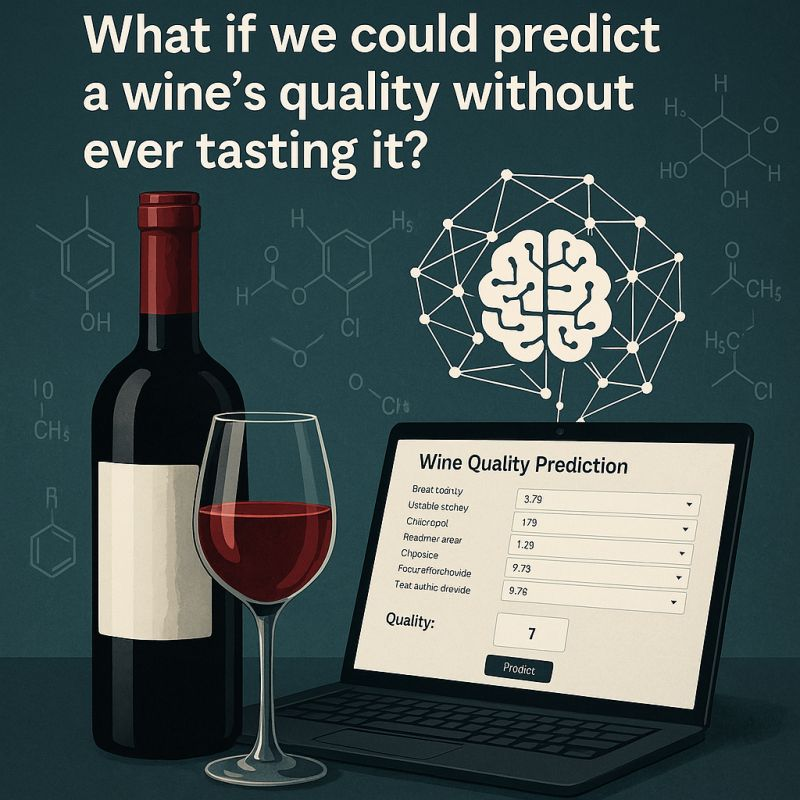

Check my Portfolio and some of my projects in the link below.

[Data Science, AI and Machine Learning Portfolio](https://github.com/DrAdrianDC/Portfolio-Machine_Learning)
  

You'll find a collection of End-to-End Machine Learning and Data Science projects I've worked on, showcasing my skills and expertise in **machine learning**, **deep learning**, **data analysis**, **model development**. **predictive analytics** and **real-world problem-solving**. Each project includes a brief description, the tools and techniques used, and links to the code and any related information.

<table align="center">
<tr>
<td align="center" width="33%">
  <a href="https://github.com/DrAdrianDC/Portfolio-Machine_Learning/tree/main/Project-2-Wine-Quality-Prediction">
     
  </a>
  <em>Wine Quality Prediction 
  <small><i>Machine Learning</i> Project</small></em>
</td>
<td align="center" width="33%">
  <a href="https://github.com/DrAdrianDC/Portfolio-Machine_Learning/tree/main/Project-3-WTI%20Oil%20Prices%20Anomaly%20Detection">
     
  </a>
  <em>WTI Oil Prices Anomaly Detection 
  <small><i>Machine Learning</i> Project</small></em>
</td>
<td align="center" width="33%">
  <a href="https://github.com/DrAdrianDC/Portfolio-Machine_Learning/tree/main/Project-6-DFT%20Meets%20Machine%20Learning">
     
  </a>
  <em>DFT Meets Machine Learning 
  <small><i>Computational Chemistry</i> Project</small></em>
</td>
</tr>
</table>
