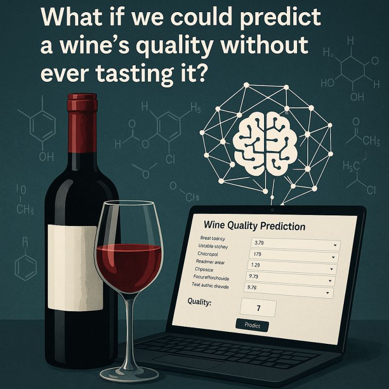

**For a complete description and full list of projects, please check my Portfolio for Data Science and Machine Learning in the link below:**

[Data Science, AI and Machine Learning Portfolio](https://github.com/DrAdrianDC/Portfolio-Machine_Learning)
  

## Selected Projects

<table align="center">
<tr>
<td align="center" width="33%">
  <a href="https://github.com/DrAdrianDC/Portfolio-Machine_Learning/tree/main/Project-2-Wine-Quality-Prediction">
     
    Wine Quality Prediction
  </a>
</td>

<td align="center" width="33%">
  <a href="https://github.com/DrAdrianDC/Portfolio-Machine_Learning/tree/main/Project-3-WTI%20Oil%20Prices%20Anomaly%20Detection">
     
    WTI Oil Prices Anomaly Detection
  </a>
</td>

<td align="center" width="33%">
  <a href="https://github.com/DrAdrianDC/Portfolio-Machine_Learning/tree/main/Project-6-DFT%20Meets%20Machine%20Learning">
     
    DFT Meets Machine Learning
  </a>
</td>
</tr>
</table>

