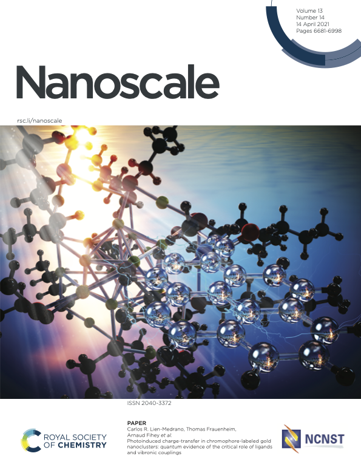
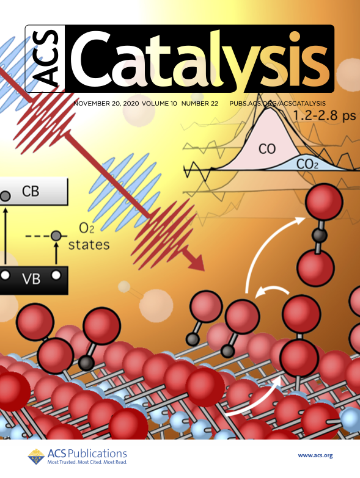

For the full list of my research publications, please visit my  [Google Scholar Profile](https://scholar.google.com/citations?user=OEWI__oAAAAJ&hl=en&oi=ao)

<table align="center">
<tr>
<td align="center" width="50%">
   
  <em>Selected Cover – <a href="https://doi.org/10.1039/d1nr00213a">Photoinduced charge-transfer in chromophore-labeled gold nanoclusters: quantum evidence of the critical role of ligands and vibronic couplings</a> <small><i>Nanoscale</i> (2021)</small></em>
</td>
<td align="center" width="50%">
   
  <em>Selected Cover – <a href="https://doi.org/10.1021/acscatal.0c04098">Ultrafast Real-Time Dynamics of CO Oxidation over an Oxide Photocatalyst</a> <small><i>ACS Catalysis</i> (2020)</small></em>
</td>
</tr>
</table>

## 📚 Selected Publications

- **Adrian Dominguez-Castro**. DFT and machine learning for predicting hydrogen adsorption energies on rocksalt complex oxides. *Theor. Chem. Acc.* **143**, 50 (2024). [doi:10.1007/s00214-024-03124-x](https://doi.org/10.1007/s00214-024-03124-x)

- Michael Wagstaffe, **Adrian Dominguez-Castro**, Lukas Wenthaus, Steffen Palutke, Dmytro Kutnyakhov, Michael Heber, Federico Pressacco, Siarhei Dziarzhytski, Helena Gleißner, Verena Kristin Gupta, Harald Redlin, Adriel Dominguez, Thomas Frauenheim, Angel Rubio, Andreas Stierle, and Heshmat Noei. Photoinduced Dynamics at the Water/TiO₂ (101) Interface. *Phys. Rev. Lett.* **130**, 108001 (2023). [doi:10.1103/PhysRevLett.130.108001](https://doi.org/10.1103/PhysRevLett.130.108001)

- **Adrian Domínguez-Castro** and Thomas Frauenheim. Impact of vibronic coupling effects on light-driven charge transfer in pyrene-functionalized middle and large-sized metalloid gold nanoclusters from Ehrenfest dynamics. *Phys. Chem. Chem. Phys.*, **23**, 17129–17133 (2021). [doi:10.1039/d1cp02890a](https://doi.org/10.1039/d1cp02890a)

- **Adrian Domínguez-Castro**, Carlos R. Lien-Medrano, Khaoula Maghrebi, Sabri Messaoudi, Thomas Frauenheim, and Arnaud Fihey. Photoinduced charge-transfer in chromophore-labeled gold nanoclusters: quantum evidence of the critical role of ligands and vibronic couplings. *Nanoscale*, **13**, 6786–6797 (2021). [doi:10.1039/d1nr00213a](https://doi.org/10.1039/d1nr00213a)

- Michael Wagstaffe, Lukas Wenthaus, **Adrian Dominguez-Castro**, Simon Chung, Guilherme Dalla Lana Semione, Steffen Palutke, Giuseppe Mercurio, Siarhei Dziarzhytski, Harald Redlin, Nicolai Klemke, Yudong Yang, Thomas Frauenheim, Adriel Dominguez, Franz Kärtner, Angel Rubio, Wilfried Wurth, Andreas Stierle, and Heshmat Noei. Ultrafast Real-Time Dynamics of CO Oxidation over an Oxide Photocatalyst. *ACS Catal.* **10**, 13650−13658 (2020). [doi:10.1021/acscatal.0c04098](https://doi.org/10.1021/acscatal.0c04098)

- **Adrian Domínguez-Castro**, Dariel Hernández, and Fernando Guzmán. Insights into the interactions of biomolecules with small gold clusters: a theoretical study from a DFTB perspective. *Theor. Chem. Acc.* **136**, 84 (2017). [doi:10.1007/s00214-017-2118-7](https://doi.org/10.1007/s00214-017-2118-7)

- **Adrian Dominguez-Castro**, Fernando Guzman, Yasser Novo-Fernandez. Adsorption on a nanoporous organic polymer for clean energy applications: A multiscale modelling study using Density Functional Tight Binding Approach. *Computational and Theoretical Chemistry* **1102**, 30–37 (2017). [doi:10.1016/j.comptc.2016.12.037](https://doi.org/10.1016/j.comptc.2016.12.037)

- R. Castañeda-Arriaga, **A. Domínguez-Castro**, J. Lee, J. R. Alvarez-Idaboy, N. Mora-Diez. Chemical Repair of Protein Carbon-Centred Radicals: Long-Distance Dynamic Factors. *Can. J. Chem.* **94** (12), 1119–1126 (2016). [doi:10.1139/cjc-2016-0230](https://doi.org/10.1139/cjc-2016-0230)
